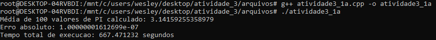

#### Disciplina: Fluxo de Projeto em Sistemas Embarcados
#### Discente: Wesley Brito da Silva
#### Matrícula: 

### Atividade 3.1: Desenvolver código com paradigma paralelo para estimar o número PI

Baseando-se no código em C abaixo, deve ser feito em c++ em máquina virtual, SO Linux ou através do terminal do Linux no Windows com WSL. No caso deste trabalho, foi feito em WSL, sendo a versão do terminal:

- 

Para uma máquina com as configurações de CPU que se encontram na imagem abaixo:

- 

Abaixo tem-se um exemplo de código para encontrar o valor de PI com a variável SOMA compartilhada entre as T threads, sem controle à eventual seção crítica:

```C
void* calcPartialPI sum(void* rank) {
    long my_rank = (long) rank; //typecast
    double factor;
    long long i;
    long long my_n = n/T;
    long long my_first_i = my_n*my_rank;
    long long my_last_i = my_first_i + my_n;

    if (my_first_i % 2 == 0) /* my first i is even */
        factor = 1.0;
    else /* my first i is odd */
        factor = -1.0;

    for (i = my_first_i; i < my_last_i; i++, factor = -factor) {
            sum += factor/(2i+1);
    }

    return NULL;
} 
```
#### Pede-se:
 a) PIparallel_1: Elaborar versão do código incluindo seção crítica controlada por MUTEX dentro do loop, tal como em: https://github.com/josenalde/flux-embedded-design/blob/main/src/pthread_count3s_mutex_1.cpp

 - <font color="red"> Para isso, foi feito a adaptação que se encontra no link: https://github.com/wesley-b1/Processamento-Paralelo-Fluxo-Embarcado/blob/main/arquivos/atividade3_1a.cpp.</br> 
 - Usando o código de compilação, no WSL, `g++ atividade3_1a.cpp -o atividade3_1a`, depois `./atividade3_1a` para executar. </br> 
 - Como resultado do processamento, teve um tempo de 667 segundos, como visto na imagem abaixo:</br>
  
  </font>

b) PIparallel_2: Elaborar versão do código incluindo seção crítica controlada por MUTEX fora do loop, com variável privada da soma de contribuição de cada thread, tal como em: https://github.com/josenalde/flux-embedded-design/blob/main/src/pthread_count3s_mutex_3.cpp.
- <font color="red"> A mudança necessária se encontra no link da atividade: https://github.com/wesley-b1/Processamento-Paralelo-Fluxo-Embarcado/blob/main/arquivos/atividade3_1b.cpp.</br>
- Compilando da mesma forma que a questão anterior, temos o resultado com um tempo de processamento muito menor,já que a região crítica se encontra fora do loop. Sendo assim, a imagem abaixo apresenta os outros valores:</br>


</font>


c) PIserial: Rodar versão do código serial, sem paralelismo, ou seja, com 1 thread:
- <font color="red"> Após rodar com uma thread, para processar, ele demorou 37 segundos, enquanto os outros resultados, são apresentados na imagem abaixo:</br>
 
</font>


d) criar tabela comparativa das letras a) e b) para o caso de 1 thread por core e de 2 threads por core. Exemplo: se a CPU tem 4 cores e até 2 threads por core, fazer para T=4 e T=8. Se tem 08 cores, fazer para T=8 e T=16. Na tabela deixar claro qual a CPU em que está rodando a aplicação (no linux comando lscpu), detalhando número de cores/threads, níveis de cache e tamanho de cada cache (L1, L2, L3). Pode ser usado o método presente nos arquivos acima para calcular o tempo, usando clock() do C, ou o chrono do C++ ou o omp_get_wtime() do omp.h. A tabela resumo deve ter aparência como neste exemplo, comparando o caso SERIAL com os dois casos PARALELOS: formatar número de saída com 12 casas decimais, com cout.precision(12) e na hora de exibir uma variável, suponha x, fazer cout << fixed << x;

Apresentar na tabela a coluna com o PI calculado e a coluna com o tempo médio de 10 execuções para cada caso.


- Nas imagens abaixo podemos ver as respostas pedidas:
- 
- 
